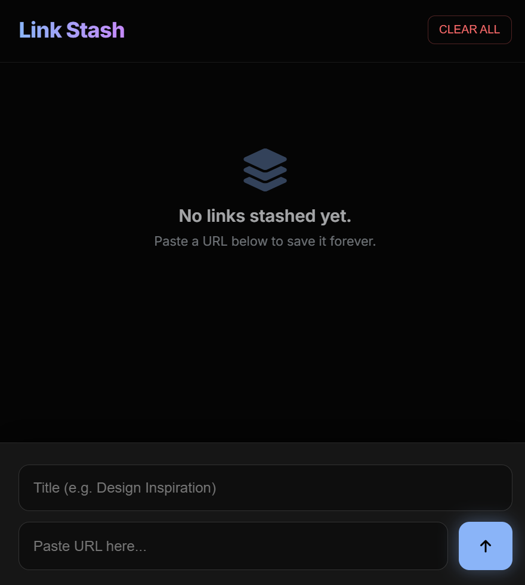
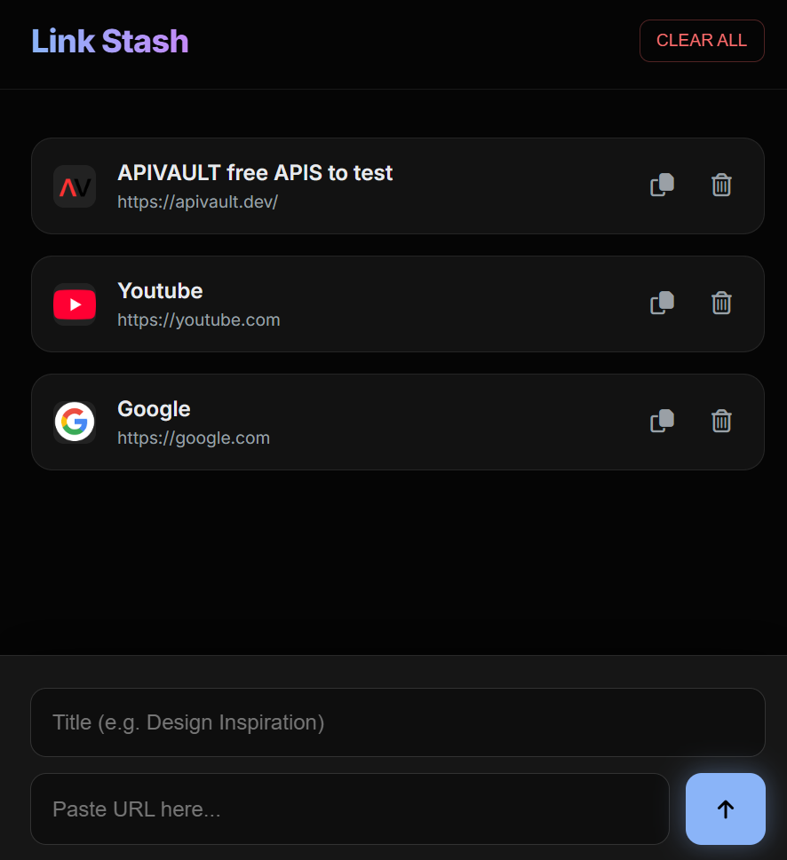

# Link Stash

This is a small, simple link saver I made. It's beginner-friendly and works right in your browser.

## What it does
- Save links with an optional title.
- Shows a favicon for each saved link (fetched from Google).
- Stores all links in your browser using `localStorage` so they stay after refresh.
- Lets you copy a URL, delete a single link, or clear all links.

## How to use (very simple)
1. Open the project folder and double-click `index.html` (or open it in your browser).
2. In the bottom input, paste a URL into the "Paste URL here..." box.
3. (Optional) Add a title in the "Title" field.
4. Click the save button (the arrow) to add the link to the top of the list.
5. Click a saved link to open it in a new tab.
6. Use the copy icon to copy the URL or the trash icon to remove a single link.
7. Press `CLEAR ALL` to remove everything (it asks for confirmation).

## Files
- `index.html` — the whole app (HTML, CSS, and JS in one file).

## Tech used
- Plain HTML, CSS, and JavaScript.
- Favicons are retrieved from `https://www.google.com/s2/favicons`.
- Data is saved with the browser `localStorage` API.

## Notes / Tips
- If a URL doesn't start with `http` or `https`, the app adds `https://` automatically.
- The empty state message shows when you don't have any links yet.
- Works offline for storing links, but favicons need internet to load.

## Screenshots

- 
- 

Built with curiosity and a pinch of code — stash links, spark ideas.
